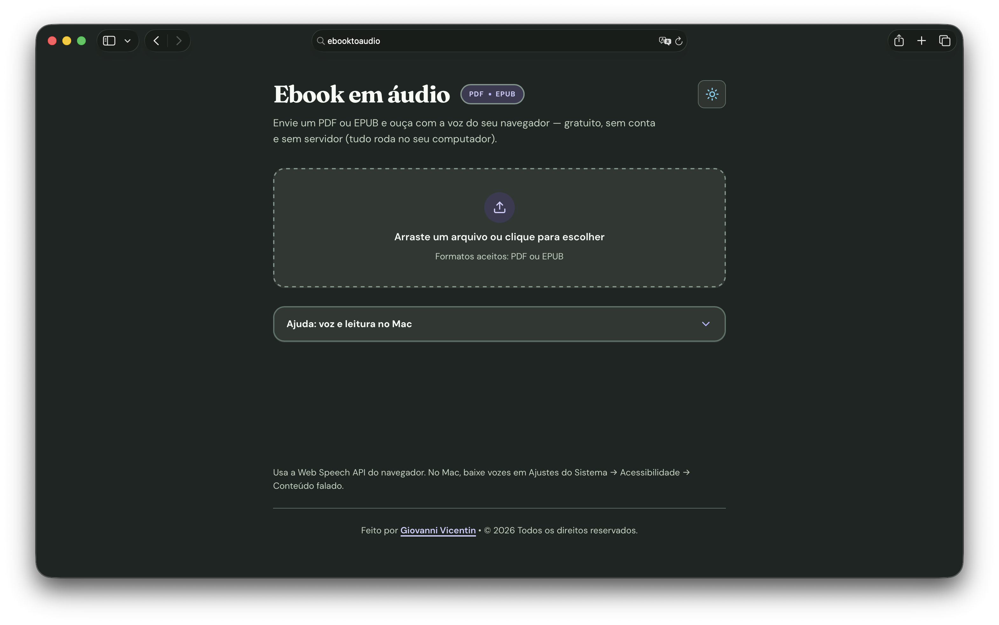

# Ebook to Audiobook



Web app to turn **PDF** and **EPUB** files into audio directly in the browser, focused on smooth reading, privacy, and a simple audiobook-like experience.

Aplicação web para transformar arquivos **PDF** e **EPUB** em áudio no navegador, com foco em leitura fluida, privacidade e uma experiência simples de audiolivro.

## English

### Overview

This project lets users upload **PDF** or **EPUB** files, extract text locally in the browser, and listen to the content using the system voices available through the **Web Speech API**.

Everything runs on the client:

- no backend
- no server upload
- no account
- no paid API

### Preview

The main project preview and social sharing image is available at [`public/preview.png`](./public/preview.png).

### Stack

- React 19
- TypeScript
- Vite
- PDF.js for PDF text extraction
- JSZip for EPUB structure parsing
- Web Speech API for browser-based speech synthesis

### Getting started

```bash
npm install
npm run dev
```

To create a production build:

```bash
npm run build
```

To preview the production build:

```bash
npm run preview
```

### How to use

1. Open the app in your browser.
2. Upload a `.pdf` or `.epub` file.
3. Choose language, voice, speed, and pitch.
4. Start playback.
5. Follow the text preview, reading progress, and playback controls.

### Features

- Click-to-upload and drag-and-drop support
- PDF and EPUB support
- Local text extraction
- Language and voice selection
- Speed and pitch controls
- Chunk-based reading navigation
- Progress bar and estimated duration
- Light and dark themes
- Responsive interface

### Limitations

- Scanned PDFs without embedded text require OCR, which is not included.
- Voice quality depends on the operating system and browser.
- Lock screen playback, car Bluetooth controls, and advanced media integration are not reliable with `speechSynthesis`.
- On macOS, installing additional voices in `System Settings → Accessibility → Spoken Content` may improve results.

### UI themes and colors

The UI uses a custom visual direction with two theme variations: **light** and **dark**.

Core palette:

- Matcha Latte: `#d1efbd`
- Botanist: `#89d385`
- Aquamarine: `#6cd1f0`
- Grape Soda: `#a1a1f7`
- Pink Diamond: `#efccea`

Visual notes:

- `DM Sans` and `Fraunces` typography pairing
- Defined borders and soft contrast
- Cool-toned accents for actions and controls
- Bright surfaces in light mode and earthy muted tones in dark mode

### Deployment

The `dist/` folder generated by the build can be deployed to static hosting platforms such as:

- GitHub Pages
- Cloudflare Pages
- Vercel
- Netlify

### Credits

Created by **Giovanni Vicentin**  
Website: [giovannivicentin.com](https://giovannivicentin.com)

---

## Português (Brasil)

### Visão geral

O projeto permite enviar um ebook em **PDF** ou **EPUB**, extrair o texto localmente no navegador e ouvir o conteúdo com as vozes disponíveis no sistema via **Web Speech API**.

Tudo roda no cliente:

- sem backend
- sem upload para servidor
- sem conta
- sem API paga

### Preview

O preview usado no projeto e nos metadados sociais está em [`public/preview.png`](./public/preview.png).

### Stack

- React 19
- TypeScript
- Vite
- PDF.js para extração de texto em PDF
- JSZip para leitura da estrutura EPUB
- Web Speech API para síntese de voz no navegador

### Como rodar

```bash
npm install
npm run dev
```

Para gerar build de produção:

```bash
npm run build
```

Para pré-visualizar a build:

```bash
npm run preview
```

### Como usar

1. Abra a aplicação no navegador.
2. Envie um arquivo `.pdf` ou `.epub`.
3. Escolha idioma, voz, velocidade e tom.
4. Inicie a reprodução.
5. Acompanhe a prévia do texto, progresso e controles de leitura.

### Funcionalidades

- Upload por clique ou arrastar e soltar
- Suporte a PDF e EPUB
- Extração local de texto
- Seleção de idioma e voz
- Controle de velocidade e pitch
- Navegação por trechos
- Barra de progresso e tempo estimado
- Tema claro e escuro
- Interface responsiva

### Limitações

- PDFs escaneados sem camada de texto precisam de OCR, que não está incluído.
- A qualidade das vozes depende do sistema operacional e do navegador.
- Recursos como tela bloqueada, Bluetooth automotivo e controles avançados de mídia não são confiáveis com `speechSynthesis`.
- No macOS, instalar vozes em `Ajustes do Sistema → Acessibilidade → Conteúdo falado` pode melhorar bastante o resultado.

### UI, temas e cores

O projeto usa uma direção visual própria com duas variações de tema: **light** e **dark**.

Paleta-base:

- Matcha Latte: `#d1efbd`
- Botanist: `#89d385`
- Aquamarine: `#6cd1f0`
- Grape Soda: `#a1a1f7`
- Pink Diamond: `#efccea`

Decisões visuais:

- Tipografia com `DM Sans` e `Fraunces`
- Bordas marcadas e contrastes suaves
- Acentos frios para ações e controles
- Superfícies claras no tema light e tons terrosos/vegetais no dark

### Publicação

A pasta `dist/` gerada pelo build pode ser publicada em serviços estáticos como:

- GitHub Pages
- Cloudflare Pages
- Vercel
- Netlify

### Créditos

Criado por **Giovanni Vicentin**  
Site: [giovannivicentin.com](https://giovannivicentin.com)
